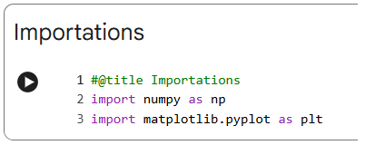
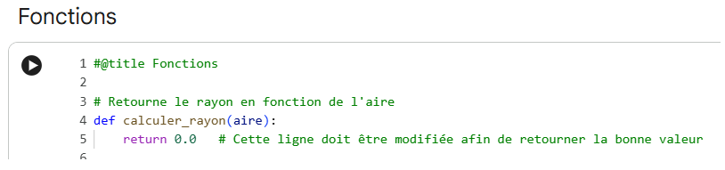
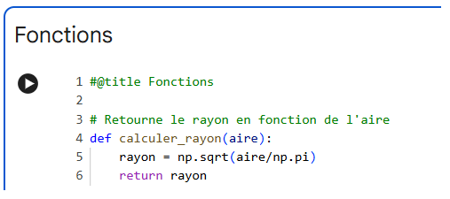
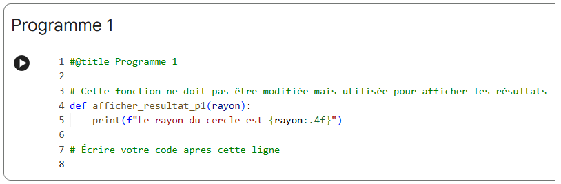
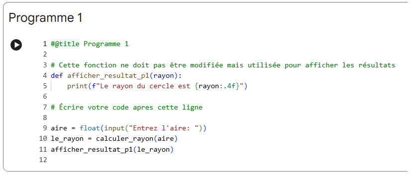

# Guide de réalisation du programme 1

Voici un petit de réalisation du programme 1 de l'exercice formatif. Vous y verrez comment compléter la fonction requise pour le programme, comment compléter le programme et comment exécuter les tests de fonctions à la fin du _notebook_ à compléter.

## La cellule Importations

La cellule Importation contient les importations nécessaires pour l'ensemble du fichier. Il faut l'exécuter à chaque séance de travail.

## La cellule Fonctions

La cellule Fonctions contient les fonctions à réaliser. Il faut exécuter la cellule à chaque fois qu'une fonction est modifiée avant de l'utiliser dans les programmes.

Voici la fonction calculer_aire avant qu'elle soit réalisée:

Voici la fonction calculer_aire après qu'elle soit réalisée:

Une fois que la fonction est réalisée, il faut exécuter la cellule Fonctions afin que les modifications soient enregistrées en mémoire.

## La cellule de Programme

Les cellules de programme contiennent les programmes à réaliser.

Voici le programme #1 avant sa réalisation:

Voici le programme #1 après sa réalisation:

## Les cellules de tests

Il est possible de tester les fonctions indépendamment des programmes. Chaque fonction contient une cellule de tests que vous pouvez exécuter de façon indépendante. La cellule contient des tests ainsi que la sortie attendue de chaque test:

