<h3 style='text-align: right;'>Programmation en sciences
 420-SN1-RE
 Éric Wenaas
 Georges Côté
</h3>

## Édition d'un notebook

Un notebook est composé de plusieurs cellules. Chaque cellule peut être du code, du texte ou une image.
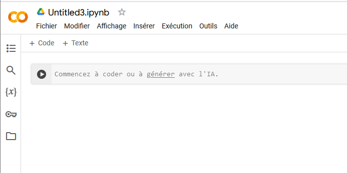

### Cellules de code

Disons qu'on veut calculer le nombre de secondes dans une journée.

Évidemment, la formule est 24 heures/jour x 60 minutes/heure x 60 secondes/minutes. Après avoir appuyé sur la flèche, on obtient
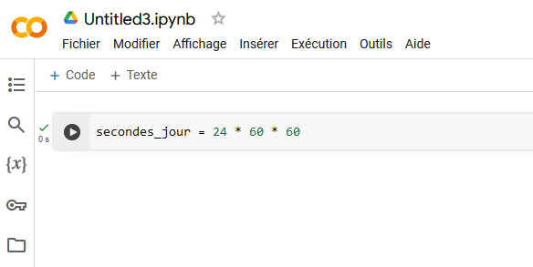

Pour voir le résultat, il faut ajouter une instruction pour l'afficher. On a le choix entre

ou bien
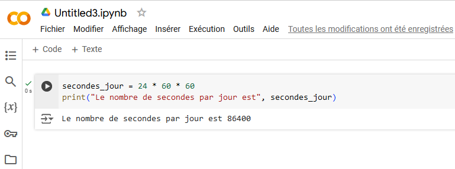

Chaque section peut contenir plusieurs lignes de code.
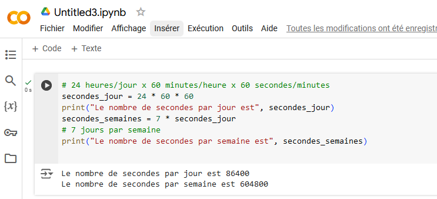

On peut aussi les séparer en plusieurs cellules:
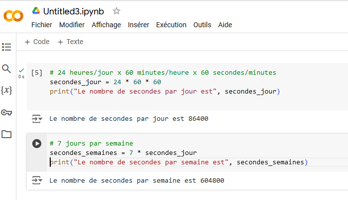

Cela nous permet de valider que chaque section fonctionne correctement avant de passer à la prochaine.

La ligne qui commence par un # est un commentaire. Elle sert à expliquer le code mais n'est pas exécutée. 

# La prochaine section est vraiment faite pour satisfaire votre curiosité si jamais cela vous intéresse mais ce n'est pas évalué et ne sera pas à l'examen
### Cellules de texte

Les cellules de texte permettent d'expliquer certaines choses plus en détail. On peut changer l'apparence du texte grâce au [markdown](https://fr.wikipedia.org/wiki/Markdown). Vous n'avez pas à connaitre le markdown dans ce cours-ci.

On va calculer le nombre de solutions pour une équation quadratique donnée. Pour cela, on va calculer le discriminant.
Si le discriminant est > 0, il y a deux solutions qui font partie de l'ensemble des nombres réels.

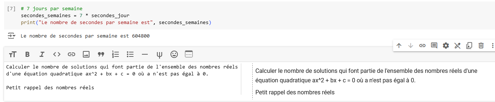

Au lieu de retaper la définition des nombres réels, vous pouvez donner le lien vers une autre page, par exemple https://www.alloprof.qc.ca/fr/eleves/bv/mathematiques/les-nombres-et-les-ensembles-de-nombres-m1356.

Le format pour un lien est 
> [texte affiché](le lien)

donc si on veut que le texte "nombres réels" devienne un lien vers une autre page:

>\[nombres réels](https://www.alloprof.qc.ca/fr/eleves/bv/mathematiques/les-nombres-et-les-ensembles-de-nombres-m1356)

devient  

[nombres réels](https://www.alloprof.qc.ca/fr/eleves/bv/mathematiques/les-nombres-et-les-ensembles-de-nombres-m1356)

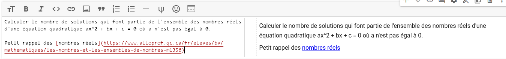

On peut afficher un en-tête, du texte en gras et/ou en italique.
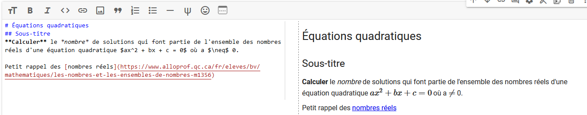

>\# En-tête

devient
# En-Tête

>\*\*Calculer\*\*
 
devient 

**Calculer**  
donc on entoure le texte qu'on désire afficher en gras avec une paire de \**

Dans un notebook, une paire de 
>\*italique\*

affiche le texte en   
*italique*.  

En markdown, le standard est 
>\_italique_

pour afficher   
_italique_.  

>\_\*\*italique et gras\*\*\_

pour afficher  
_**italique et gras**_.

Vous pouvez aussi insérer une image. Par exemple, si je veux insérer l'image suivante du site d'alloProf
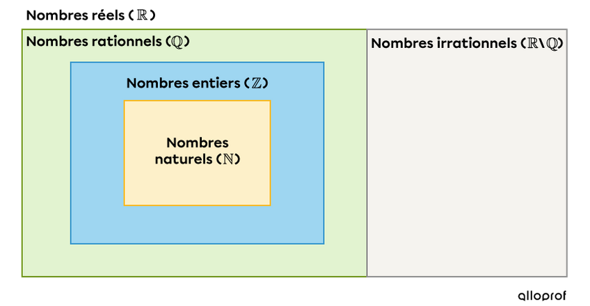,  

La première option est d'utiliser un lien vers une image
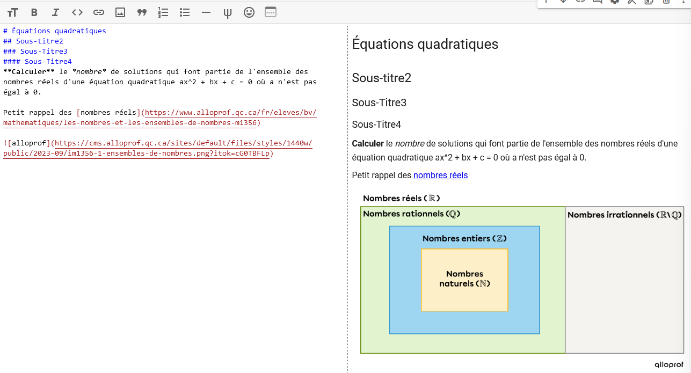   
Notez le ! au tout début de la syntaxe

La deuxième option peut être utilisée si vous avez une image sur votre disque mais l'image est convertie en base64. Pas besoin de comprendre ce qu'est la base 64 mais ça prend beaucoup d'espace.
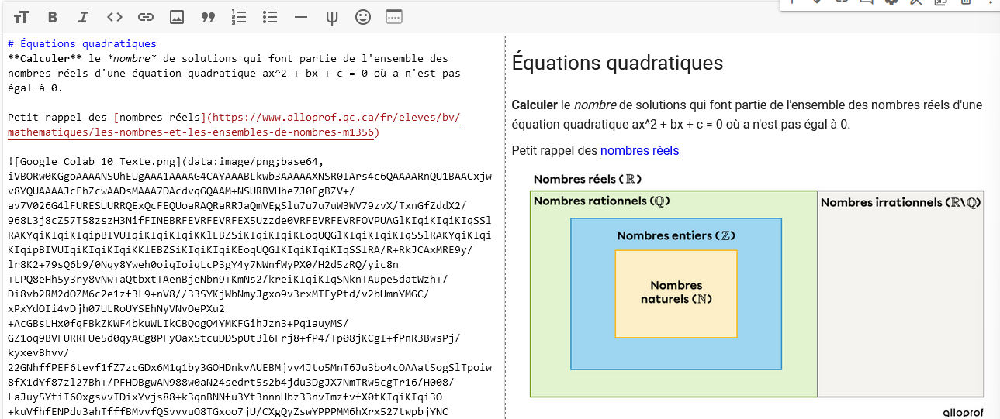 

### Affichage d'équations mathématiques (tout à fait optionnel)
Cela ne fait pas partie des éléments de compétence du cours mais si vous êtes curieux, cette petite section essaiera de vous montrer comment le faire.

Il est possible d'afficher des équations mathématiques. On utilise $\LaTeX$ [LaTeX](https://fr.wikipedia.org/wiki/LaTeX). Ça semble compliqué mais, avec un peu de pratique et votre ami Google, ça ira bien.

Disons qu'on veut afficher ce texte

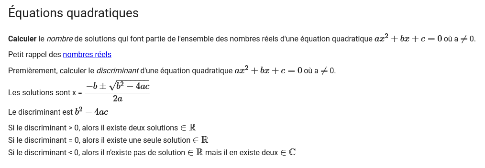

Premièrement, pour améliorer l'affichage de l'équation, on va tout simplement entourer le texte du signe  \$ pour indiquer qu'on veut du $\LaTeX$ 
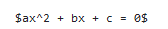  

devient 

$ax^2 + bx + c = 0$  

Pour avoir le signe $\neq$, 
on utilise 

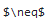  

Pour avoir le $ \in \mathbb{R}$, on utilise 
>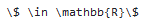  

Finalement, pour avoir x = $\dfrac{-b \pm \sqrt{b^2 - 4ac}}{2a}$, on utilise la fraction et la racine carrée.  

>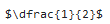  

devient  
$\dfrac{1}{2}$

On écrit 
>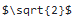  

qui devient $\sqrt{2}$  

>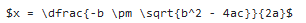   

devient 

$x = \dfrac{-b \pm \sqrt{b^2 - 4ac}}{2a}$
