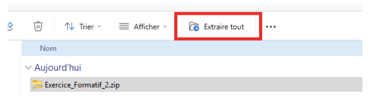
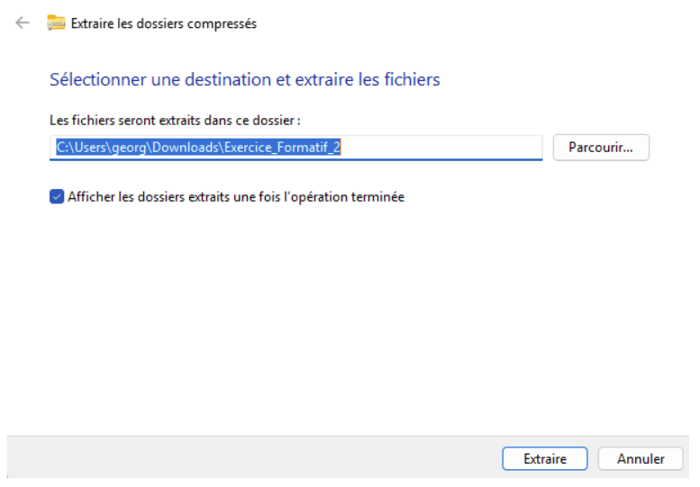
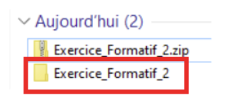
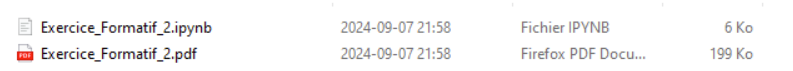
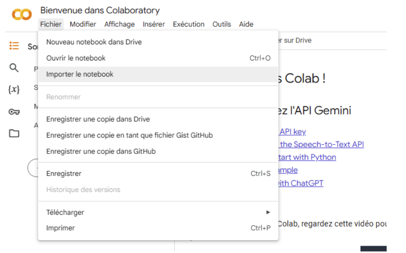
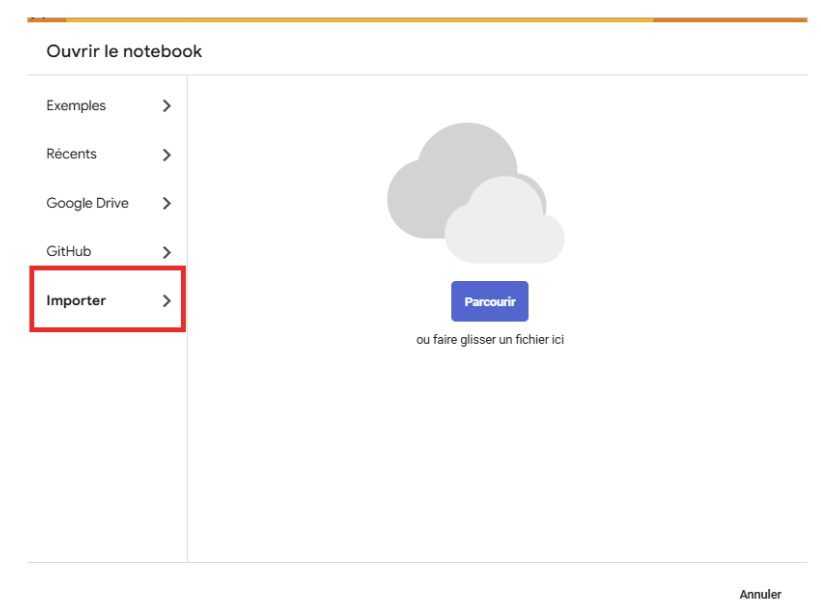

# Programmation en sciences
420-SN1-RE
Importation d’un notebook
Version 1.0

## Importation d’un notebook

Les travaux sont distribués en format .zip. Un fichier .zip est un fichier archivé comprenant plusieurs fichiers. Ce document a pour but de vous indiquer comment extraire les fichiers de l’archive et importer le notebook dans Google Colab.

L’exemple est ici développé avec le deuxième exercice formatif mais les mêmes étapes devront être répétées avec les autres travaux.

Téléchargement du fichier archivé

Vous devez cliquer sur le nom du fichier afin de le télécharger localement sur l’ordinateur:

Le fichier se retrouvera dans votre dossier Téléchargements:

Ouverture du fichier archivé

Pour ouvrir le fichier, vous sélectionnez le fichier et cliquez sur le bouton “Extraire tout”

 
Puis  

Un nouveau dossier sera alors ajouté dans votre dossier Téléchargements:

Importation du notebook dans Google Colab

Vous devez entrer dans ce dossier en double-cliquant dessus:

Le fichier .pdf contient les directives. Le fichier .ipynb est le notebook que vous devrez compléter et remettre. Vous devez préalablement l’importer dans Google Colab. 

À partir de Google Colab, vous pouvez importer le notebook

 
Le fichier sera sauvegardé dans votre Google Drive.  

