<h3 style='text-align: right;'>Programmation en sciences
 420-SN1-RE
 Éric Wenaas
 Georges Côté
 Stéphane Lévesque
 Najoua Ghrieb
  
</h3>

## Google Colab

Google Colab est un service en ligne qui permet d'écrire et exécuter le code Python à partir de n'importe quel navigateur et cela sans frais. 

Le lien est [https://colab.research.google.com/?hl=fr](https://colab.research.google.com/?hl=fr)

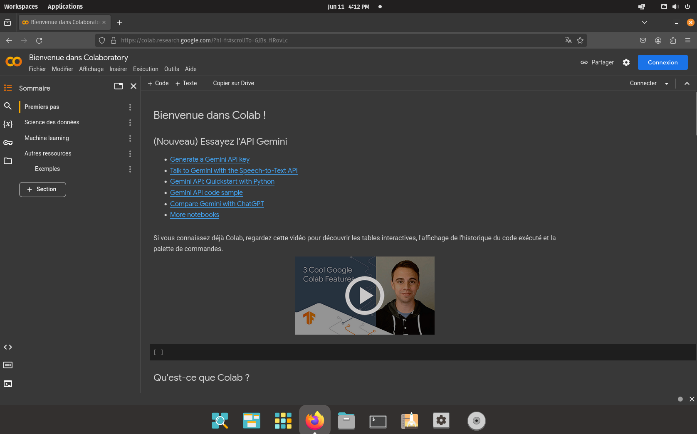

Cependant, pour pouvoir l'utiliser, vous devez vous connecter avec un compte Google. Si vous avez déjà une adresse Gmail, vous pouvez l'utiliser. Sinon, vous vous créez un compte Google gratuitement.

Appuyez sur **Connexion**

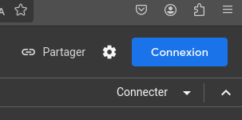

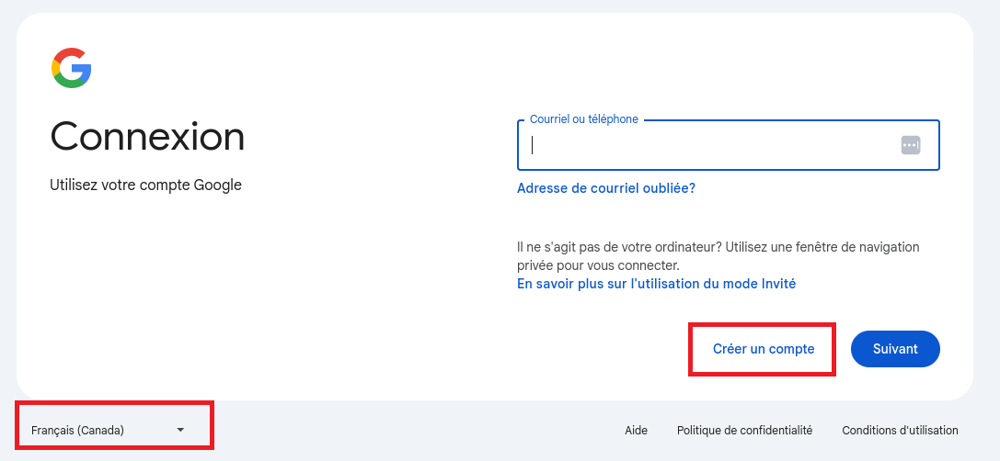

### Activation de Google Colab dans Google Drive
Si jamais vous n'avez pas les droits d'utiliser Google Colab, il est possible qu'il ne soit pas activé dans Google Drive.
Allez à [Google Drive](drive.google.com), connectez-vous puis cliquez sur *Paramètres*
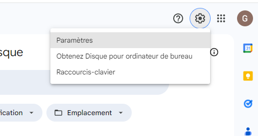  

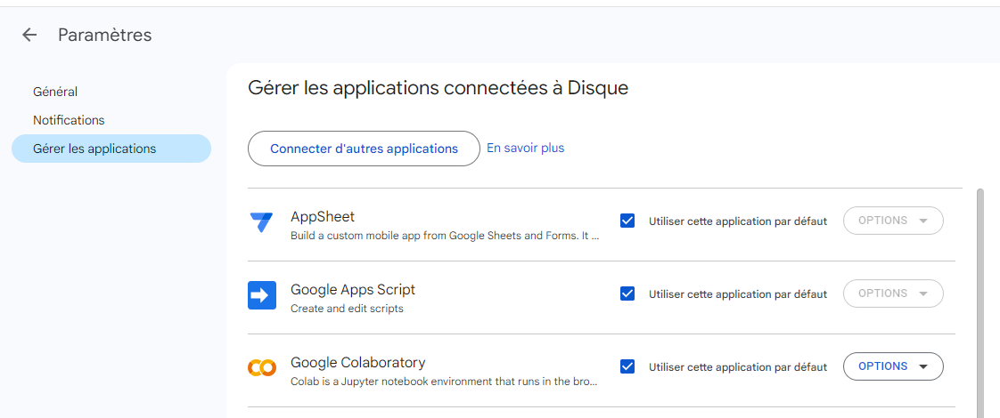

Une fois connecté, vous devriez voir ceci

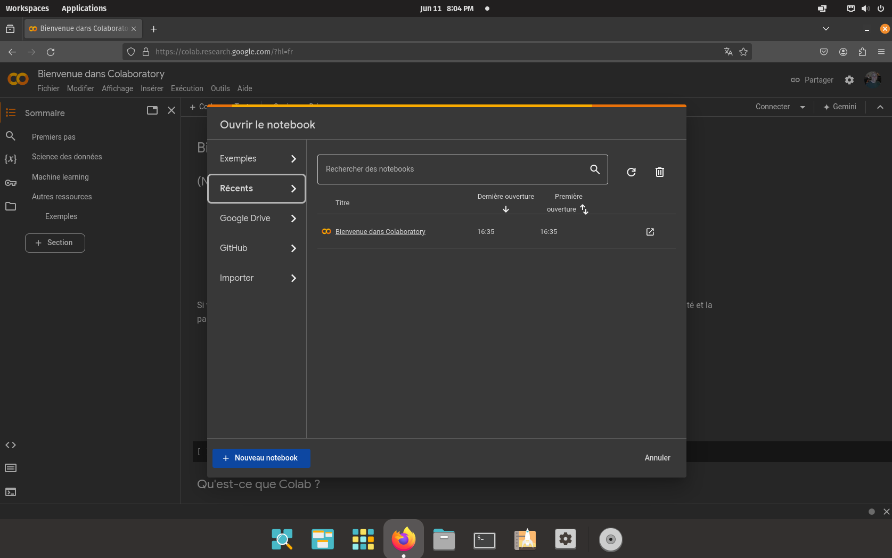

### Qu'est-ce qu'un notebook?

Les notebooks Jupyter sont des cahiers électroniques qui, dans le même document, peuvent rassembler du texte, des images, des formules mathématiques et du code informatique exécutable. Ils sont manipulables interactivement dans un navigateur web.[^1]

[^1]: https://python.sdv.univ-paris-diderot.fr/18_jupyter/.

Commençons par créer un nouveau notebook

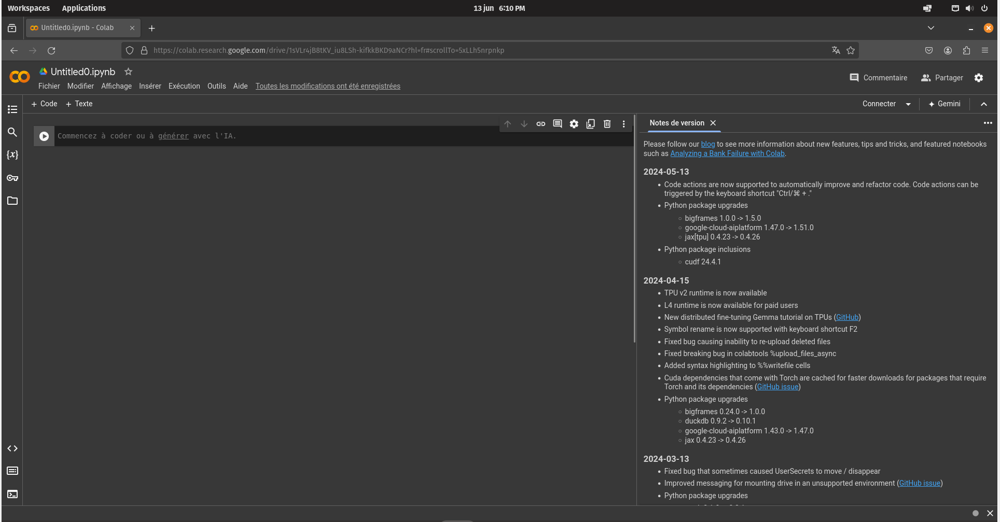

Par défaut, le nom est quelque chose comme Untitled0.ipynb (interactive python notebook)

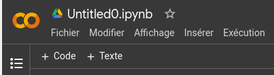

Vous devez vous assurer de bien organiser vos fichiers. Par défaut, quand on crée un nouveau notebook, il est sauvegardé dans le dossier "Colab Notebooks" dans votre Google Drive.

Vous pouvez le renommer et, surtout, le déplacer. Vous devriez vous créer un sous-dossier 420-SN1-RE et garder vos fichiers dans ce dossier.

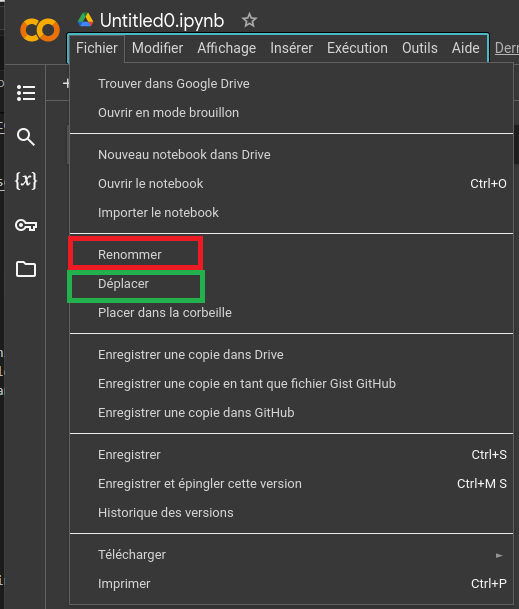

Des suggestions de noms pour vos fichiers vous seront données en classe.

### Créer un notebook à partir de Google Drive
Déplacez-vous dans le bon dossier et cliquez avec le bouton de droite de la souris.
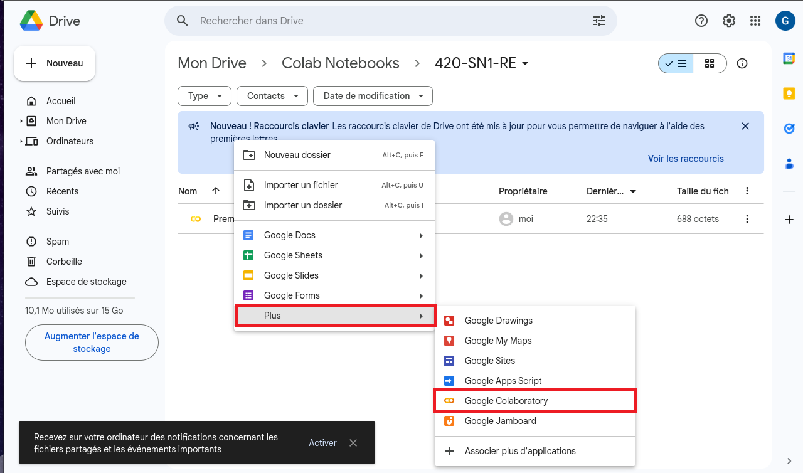. 

### Écrire notre première ligne de code

Habituellement, lorsqu'on débute, on écrit un programme qu'on appelle 'Hello World!' pour vérifier que tout fonctionne.

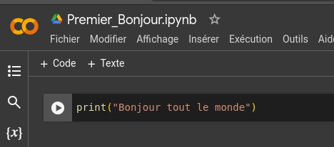. 

Une fois qu'on appuie sur , on obtient

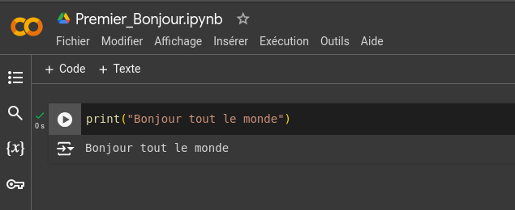. 

## Ouvrir un notebook

Vous devriez voir tous vos notebooks dans la page d'ouverture:

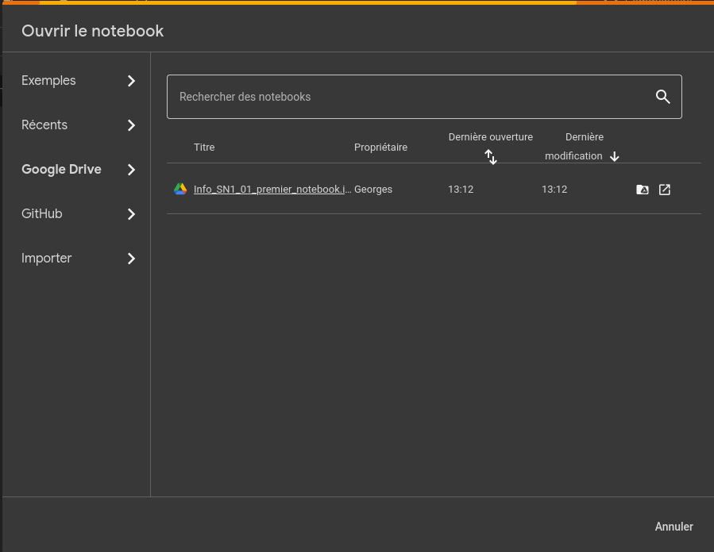. 
