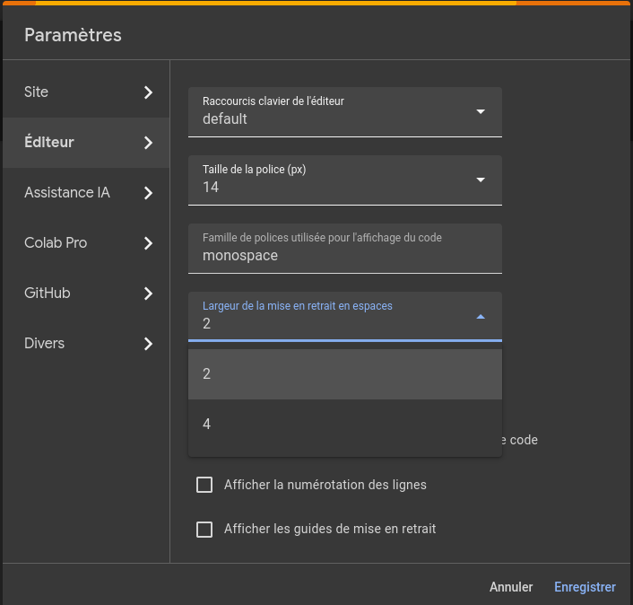
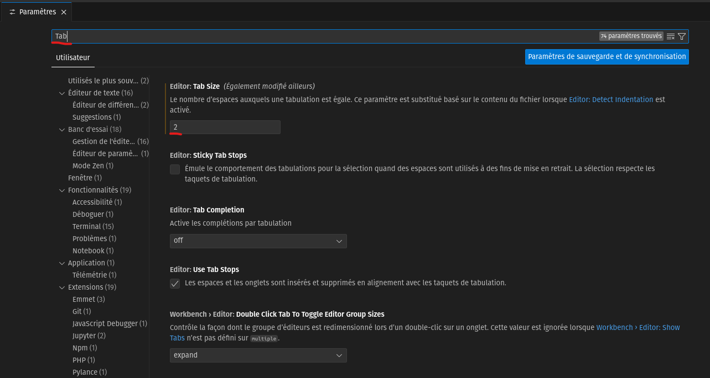

#### Programmation en sciences
#### 420-SN1-RE
#### Éric Wenaas
#### Georges Côté


## Les normes

Les différents métiers ont un code du bâtiment. Imaginez que les électriciens ne suivent pas un code très strict quand ils installent un panneau électrique. La moitié des nouvelles constructions passeraient au feu après quelques mois si c'était le cas.

En informatique, nous avons nos propres règles. Évidemment, le code ne passera pas au feu si quelqu'un ne suit pas les règles mais, vous allez voir, vous apprécierez le fait que tout le monde suit les mêmes normes.

*Les règles de codage s'articulent autour de plusieurs thèmes, les plus courants étant :*

* *Le nommage et l'organisation des fichiers du code source*
* *le style d'indentation*
* *Les conventions de nommage, ou règles de nommage*
* *Les commentaires et documentation du code source*
* *Recommandations sur la déclaration des variables*
* *Recommandations sur l'écriture des instructions, des structures de contrôle et l'usage des parenthèses dans les expressions.*

**Le même texte mais sans suivre certaines normes**

*Les 
règles de co
dage s'articulent autour de plusieurs t__hèmes, LES plus cou_rants étant :*

* *Le nommage et l'organisation des fichiers du code source*
      * *le style d'indentation*
    * *Les conventions de nommage, ou règles de nommage*
 *Les commentaires et documentation du code source* * *Recommandations sur la déclaration des 
  variables*
* *Recommandations sur l'écriture des instructions,              des structures de contrôle et l'usage des parenthèses dans les expressions.*

*C'est un peu plus difficile à lire*

*Les règles de codage permettent d'assurer une meilleure lisibilité du code en utilisant le même style de codage et en évitant les constructions qui rendent le code difficile à lire ou à modifier. Elles permettent également d'éviter les erreurs liées au langage pouvant donner des résultats incorrects, pouvant entraîner des crashs systèmes ou des failles de sécurité. Certaines règles sont également liées aux buts poursuivis par le projet logiciel : portabilité, contraintes mémoires, criticité, etc.* [^1]

[^1]: https://fr.wikipedia.org/wiki/R%C3%A8gles_de_codage.

Pour Python, habituellement, on suit les règles [PEP 8](https://peps.python.org/pep-0008/) mais on peut modifier certaines règles si on veut.

### Résumé de PEP 8 

D'autres documents seront distribués car one ne peut pas tout couvrir ici.

#### Indentation  
En Python, l'indentation (ou décalage) est très important. PEP 8 recommande 4 espaces mais Google Colab utilise 2 espaces donc on utilisera 2 espaces. Quand on appuie sur la touche *tab*, ça convertit automatiquement à 2 espaces. Dans certains éditeurs, ça insére un vrai tab mais c'est à éviter le plus possible.

Dans Google Colab, par défaut, c'est deux espaces  
  
Quand on édite un fichier dans Visual Studio Code, il détecte si on utilise 2 ou 4 espaces. On va quand même modifier la valeur par défaut.  
  

#### Les espaces
Dans certains cas, pour améliorer la lisibilté du code, on va ajouter les espaces
```
# Incorrect
x=1
y=2
```

```
# Incorrect
x =           1
y =           2
ma_variable = 3
```

```
# Correct
x = 1
y = 2
ma_variable = 3
```
Mais, dans d'autres cas, on ne va pas en rajouter
```
# Correct:
if x == 4: 
  print(x, y)
hypotenuse_au_carre = x*x + y*y
```

```
# Incorrect:
if x == 4 : 
  print (x , y)
hypotenuse_au_carre = x * x + y * y
```

#### Les variables

Le nom d'une variable peut être très court (comme x et y) ou plus long pour mieux décrire ce qu'il contient (comme hypotenuse_au_carre). On peut utiliser des accents mais on va **l'éviter**..

Règles pour le nom des variables:

    Le nom d'une variable doit commencer avec une lettre ou un sous-tiret.
    Le nom d'une variable ne peut pas commencer avec un chiffre.
    Le nom d'une variable ne peut contenir que des caractères alpha-numériques et des sous-tirets (A-z, 0-9, et _ )
    Les variables sont sensibles à la casse (age, Age et AGE sont trois variables différentes)

Chaque langage informatique a ses propres façons de nommer les variables. En Python, on utilise habituellement des lettres minuscules et chaque mot est séparé par un sous-tiret. Il va arriver qu'on utilise des lettres majuscules dans le nom de la variable pour clarifier le fait que c'est un concept mathématique par exemple.

