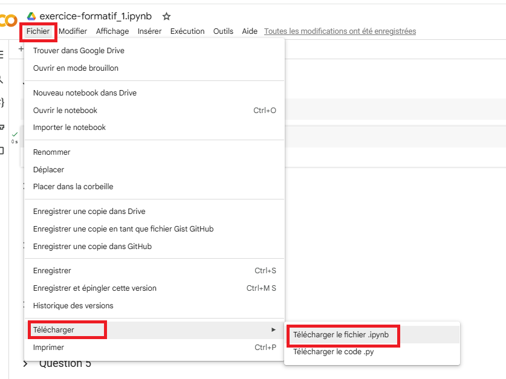
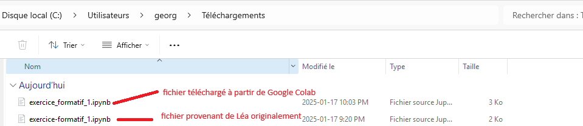
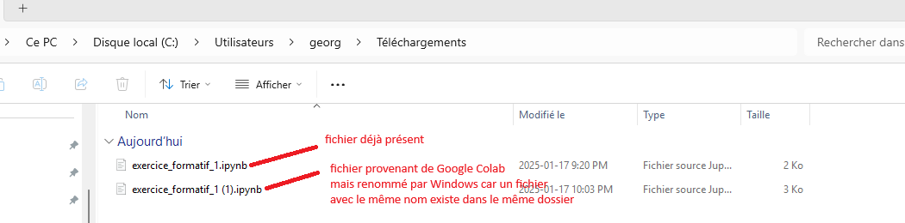
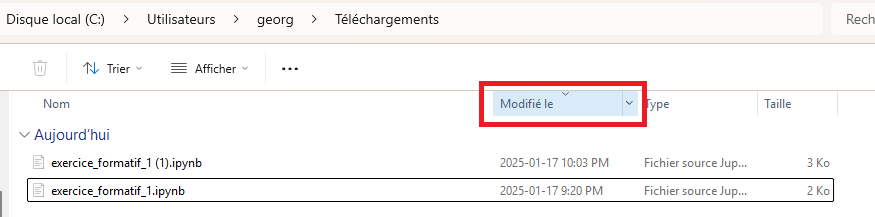
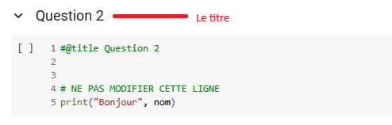
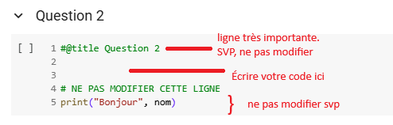
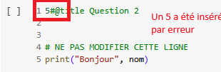

# Programmation en sciences  
420-SN1-RE  
Importation d’un notebook  
Version 1.0  

## Remise d’un notebook

#### Téléchargement du notebook à partir de Google Colab

On vous remet un exercice à compléter soit en classe ou à la maison.  

Vous importez le notebook (voir l'autre document).  

Une fois le travail complété, vous devez remettre le notebook dans Léa. Pour réussir cette opération, vous devez, en premier, télécharger le notebook, c'est-à-dire que vous transférez le notebook de votre Google Disque (Drive).

À partir de Google Colab, vous sélectionnez le menu "Fichier" puis "Télécharger" puis finalement "Télécharger le fichier .ipynb".  

Le fichier se retrouvera dans votre dossier Téléchargements.

Une fois cette opération réussie, vous pouvez remettre le fichier .ipynb dans Léa.

Attention, si vous aviez importé ce notebook à partir de Léa, il faut faire attention pour choisir le bon fichier.

Par exemple, pour le premier exercice, le nom du fichier est "exercice-formatif_1.ipynb".  

Une fois importé, Google Colab l'a renommé à "exercice_formatif_1.ipynb"  

Assurez-vous de choisir le bon fichier  

ou si le fichier téléchargé est renommé par Windows.

Vous pouvez les trier par date avec le fichier le plus récent au début pour vous éviter des erreurs.

#### Correction semi-automatisé

Quand vous remettez un notebook, nous utilisons une correction semi-automatisée. Cela veut dire que nous avons écrit du code qui valide votre code.

Cependant, certaines règles s'appliquent pour s'assurer que cette correction fonctionne bien.

Par exemple, au début d'une cellule (la section qui contient le code), vous verrez la ligne "#@title Question 2".  
Cela permet d'afficher le titre. 

Mais notre code utilise aussi cette ligne pour trouver la bonne cellule. 
Respectez le format de la cellule.

Assurez-vous que la première ligne reste telle quelle. Sans vous en rendre compte, vous allez parfois insérer un caractère supplémentaire.

Regardez votre code et corrigez ces erreurs avant de télécharger le notebook.
