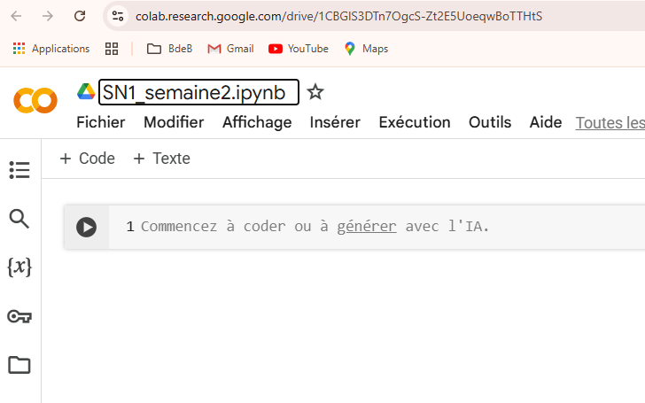
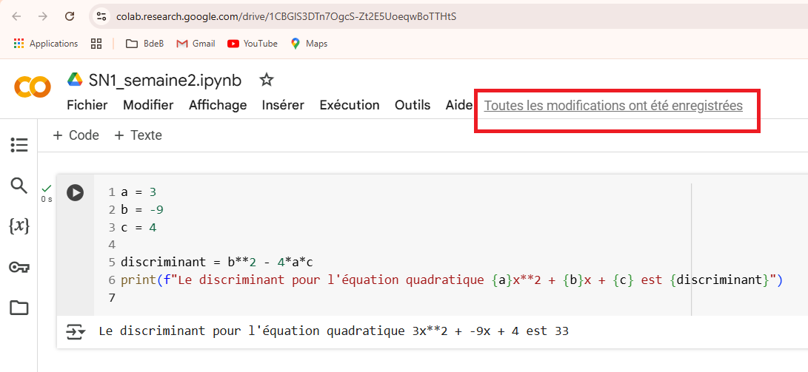
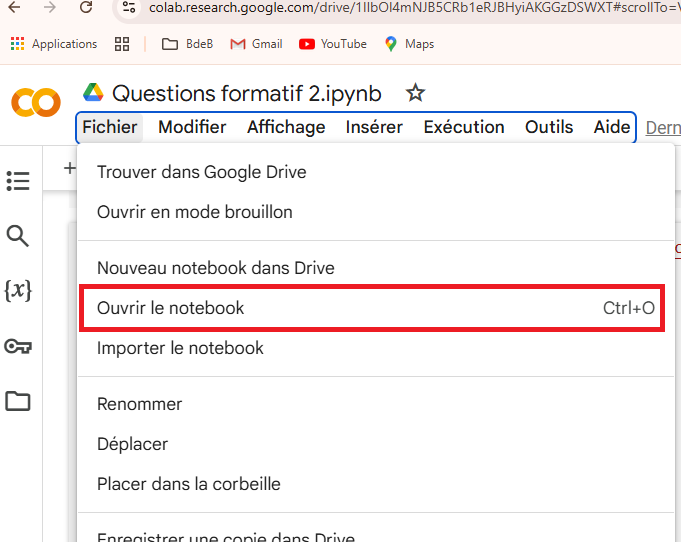
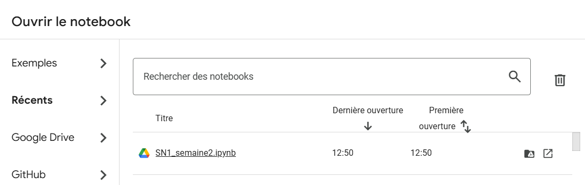
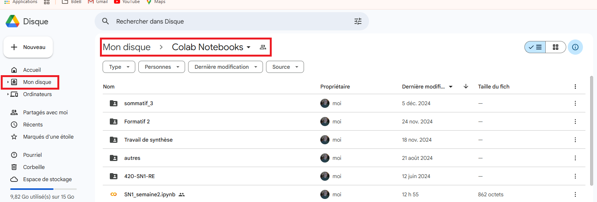

# Programmation en sciences  
420-SN1-RE  
Ouverture d’un notebook  
Version 1.0  

## Sauvegarde d’un notebook

Disons que vous avez créé un notebook en classe ou que vous en ayiez importé un.

Avant tout, il est important de le renommer si le nom est "UntitledXYZ".

#### Sauvegarde automatique

Google Colab sauvegarde votre notebook fréquemment.  

ou vous pouvez le sauvegarder en passant par le menu.  

Une fois le notebook sauvegardé, vous pouvez fermer la fenêtre du navigateur.

#### Ouverture du notebook

Il existent plusieurs méthodes simples pour ouvrir ce notebook.

#### Méthode 1

 

S'il n'est pas dans la liste de fichiers récemment ouverts, vous pouvez choisir l'onglet Google Drive

#### Méthode 2

Vous ouvrez le lien [https://drive.google.com/drive/home](https://drive.google.com/drive/home)
 puis vous sélectionnez "Mon disque", vous allez dans le dossier "Colab Notebooks".

