<h3 style='text-align: right;'>Programmation en sciences
 420-SN1-RE
 Éric Wenaas
 Georges Côté
</h3>

## Visual Studio Code

Visual Studio Code (VS Code) est un éditeur de code extensible développé par Microsoft pour Windows, Linux et macOS.[^1]
Il est léger mais puissant. Il permet aussi l'édition des fichiers ipynb. 

[^1]: https://fr.wikipedia.org/wiki/Visual_Studio_Code.

Avant de parler de cet éditeur, il est important de savoir que les notebooks créés à partir de Google Colab sont sauvegardés en ligne. Que se passe-t-il si vous désirez ouvrir vos notebooks dans un autre outil comme VS Code ou si l'accès à Internet est coupé (bon, ce n'est pas quelque chose qui se produit souvent). Si vous utilisez Windows ou macOS, il est possible d'installer une version de Google Drive qui synchronise vos fichiers sur votre lecteur. 

### Installer Google Drive

Dans le navigateur, connectez-vous à votre compte Google et choisissez Drive.

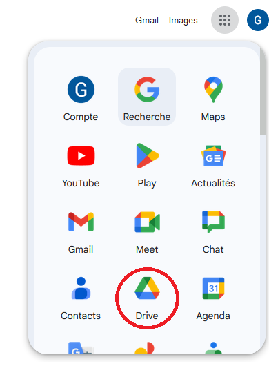

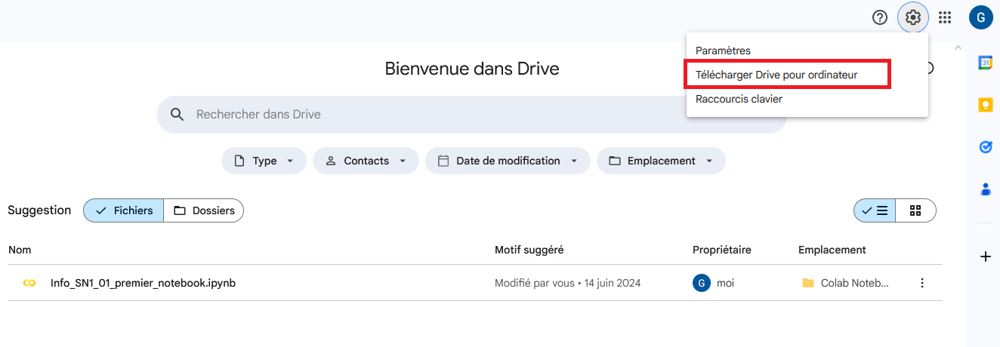

Téléchargez le logiciel et installez-le

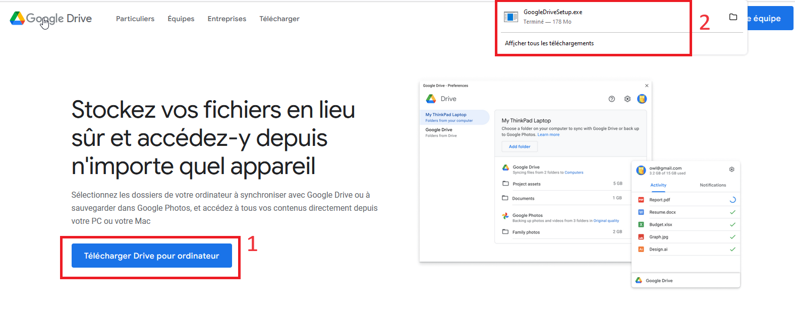

Une fois connecté, vous avez accès à vos fichiers.

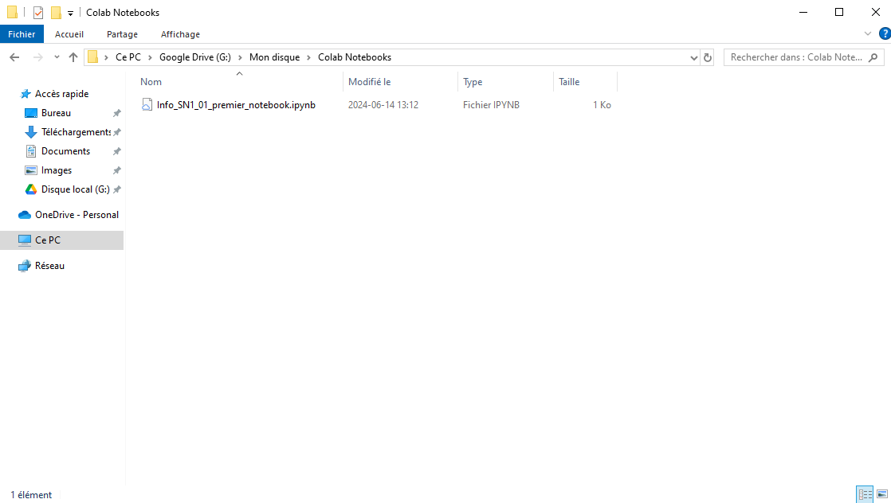

Vous pouvez aussi demander qu'une copie soit toujours disponible.

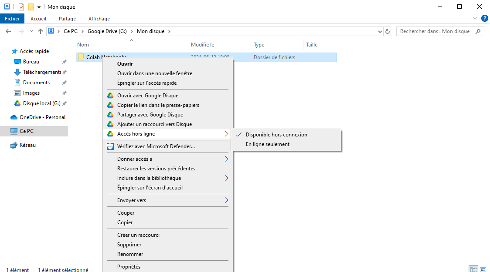

### Installer Visual Studio Code

Dans Windows, vous avez le choix de l'installer à partir du Windows Store ou de le télécharger d'[ici](https://visualstudio.microsoft.com/fr/). Choisir Visual Studio Code et non Visual Studio qui est différent.

Quand vous lancez l'éditeur, vous allez remarquer que les menus sont en anglais. Vous pouvez changer la langue d'affichage en installant une "extension".

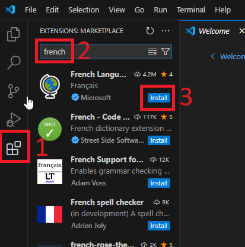

Puis, ouvrez le dossier qui contient vos notebooks.

Vous allez probablement voir un message qui vous recommande d'installer l'extension pour Python. Faites-le
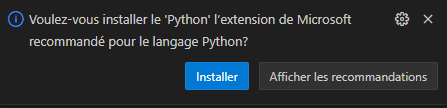

Sinon, vous cliquez sur "Extension", écrivez "Python" et prenez celle de Microsoft.
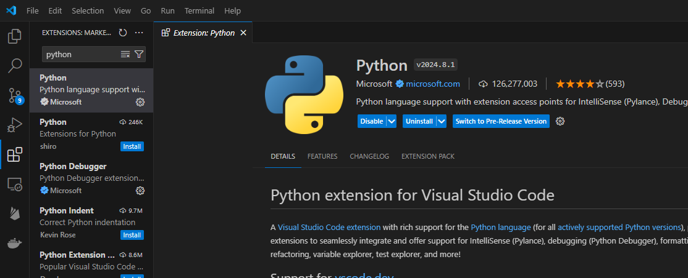

Vous pouvez créer de nouveaux fichiers dans VS Code. Vous avez le choix entre un fichier .py et un fichier .ipynb.
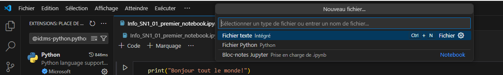
Un fichier Python est un fichier texte qui contient du code python. Il ne peut pas contenir d'images.

Il est possible qu'on vous demande d'installer un package
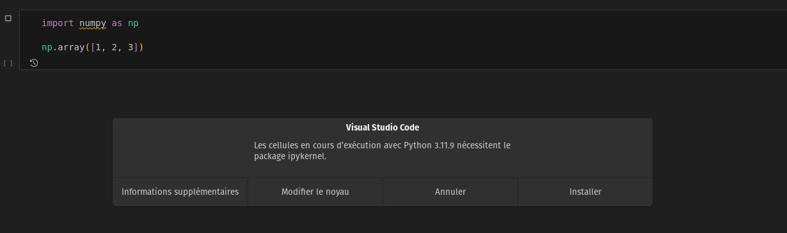

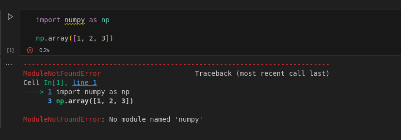
Malheureusement, VS Code n'installe pas tous les modules comme Google Colab. Il faut le faire soi-même. Ouvrir un terminal (Menu Terminal / Nouveau terminal) et tapez "pip install le_nom_du_module"

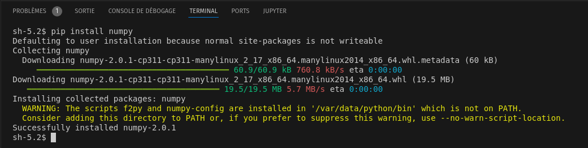

